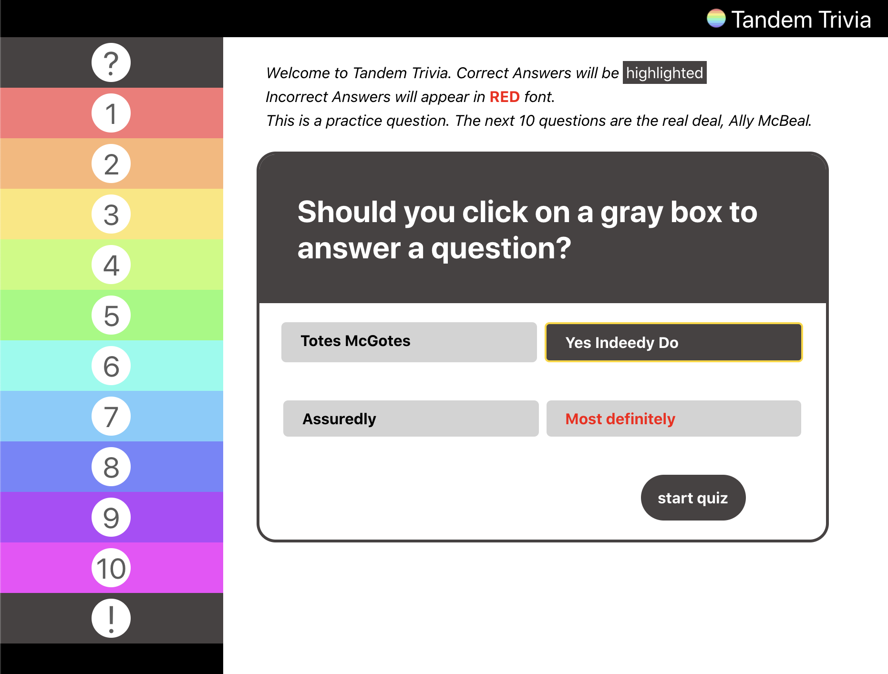
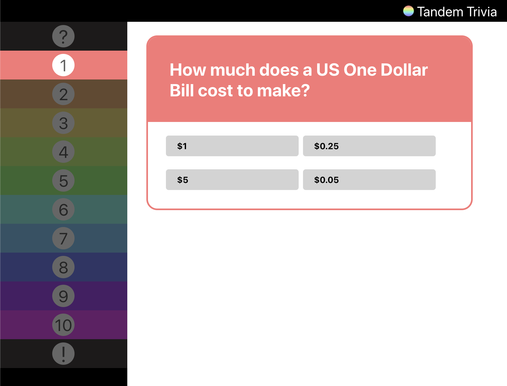
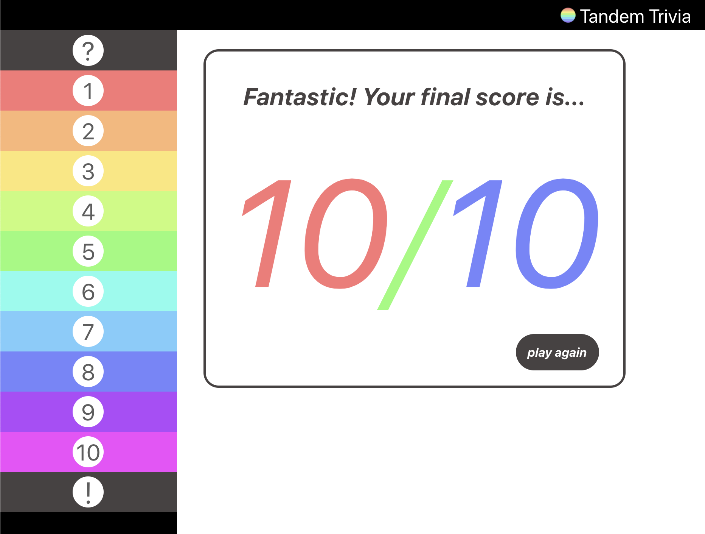

# About the App


## Table of Contents
  * [Overview](#overview)
  * [Challenges and Design](#challenges-and-design)
  * [Future Plans](#time-being-limited)
  * [Install Instructions](#install-instructions)
  * [Contact Info](#contact-me)

## Overview
This is a code challenge offered by  and I had a lot of fun with it. We were given a JSON file with 21 trivia question objects. Here's one for example.

```sh
    {
    "question": "What was Tandem previous name?",
    "incorrect": ["Tandem", "Burger Shack", "Extraordinary Humans"],
    "correct": "Devmynd"
  }
```

Applicants were instructed to build a trivia app which would present the user with ten randomly generated questions from the database. Upon answering a question, the user would be presented with the correct answer, and upon completing the quiz, the user would be presented with their final score.

We were given the freedom to choose with which language to build the app, I chose React.js.

## Challenges and Design

Built into the assignment were a few hurdles. Incorrect and Correct answers were seperate objects. A shuffle method was required to collect random questions from the database, and to present the answers in a random order during the quiz. These were resolved easily with code.

What made the challenge even more challenging, and more fun, was the room left for UI/UX considerations. How is the user introduced to the app? How are they to understand how to use it?

As pictured at the top of this page, I decided to start the app with a brief explainer and and example question to teach users about my system.

To maintain state, I avoided routing, instead I wrapped components in divs and toggled their displays throughout the process. The start quiz button hides the StarCard component and shows the QuestionCard component. The color of the question card corresponds to the highlighted color on the sidebar, letting the user know which question they are answering. 



Upon selecting an answer, the correct answer is revealed and the user is presented with the "next" button. The next button updates a counter, which corresponds to the index of the Questions Array and the Colors Array, repopulating the QuestionCard component with the Next Question and correct Background Color and Font Color in the sequence.

Upon completion of the quiz, the user is presented with a conditionally rendered message above their final tally. The "play again" button, instead of refreshing the page and bringing the user to the StartCard tutorial, fetches ten random questions from the database and begins a new quiz at Question 1.



## Time Being Limited

The hardest part of building this application was the rainbow SideBar. 

Time being limited, I was far into the build before I though to make the SideBar dynamic. Because of how I engineered components, and related question numbers to indexes of an array, I was unable to quickly build a single dynamic SideBar component, as the solution I discovered would have required reformating most of the Quiz Components. As I proceed with this application, I plan to not only build a single, dynamic SideBar component, but to replace the "tab numbers" with "correct" or "incorrect" icons upon completion of the quiz.

Time being limited, I chose to use style objects in place of cascading stylesheets. This allowed me to see changes in the browser as I made them. In the future, I would like to replace the style objects with CSS. Then, having classnames, I will use @media to design the app to respond to tablet and mobile screen sizes.

# Install Instructions

In your terminal, clone this repo and install dependencies.
```sh
    git clone git@github.com:mister-michael/TandemTrivia.git
```
cd to the tandemtrivia directory and install dependencies.
```sh
    cd tandemtrivia
    npm install
```
After installation, start the app.
```sh
    npm start
```
In a new terminal tab, cd into the api directory and start a json server on port 8080.
```sh
    cd api
    json-server -p 8080 -w Apprentice_TandemFor400_Data.json
```

## Contact Me

I hope you enjoyed the app, please feel free to reach out on [LinkedIn](https://www.linkedin.com/in/michaelclarknashville/). You can view my portfolio [portfolio](https://www.michaelclarknashville.com/), and you can try my Front End Capstone [Hipstar](https://www.hipstar.app), a functional movie rating site which connects user based on their least favorite films.

Thank you for checking out the app!


